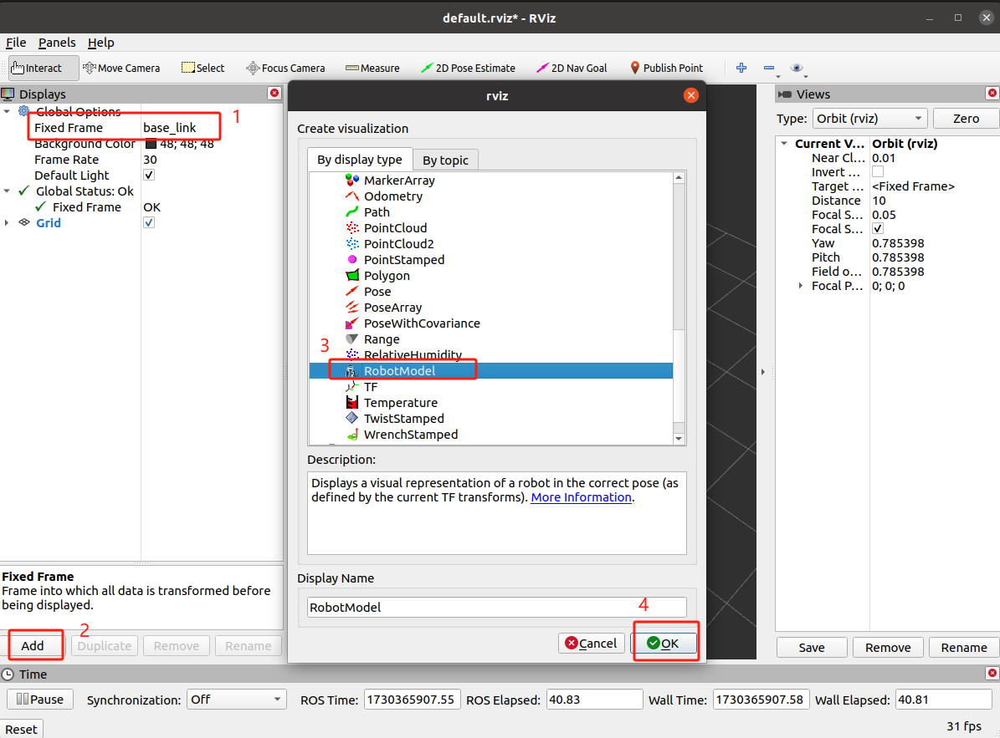
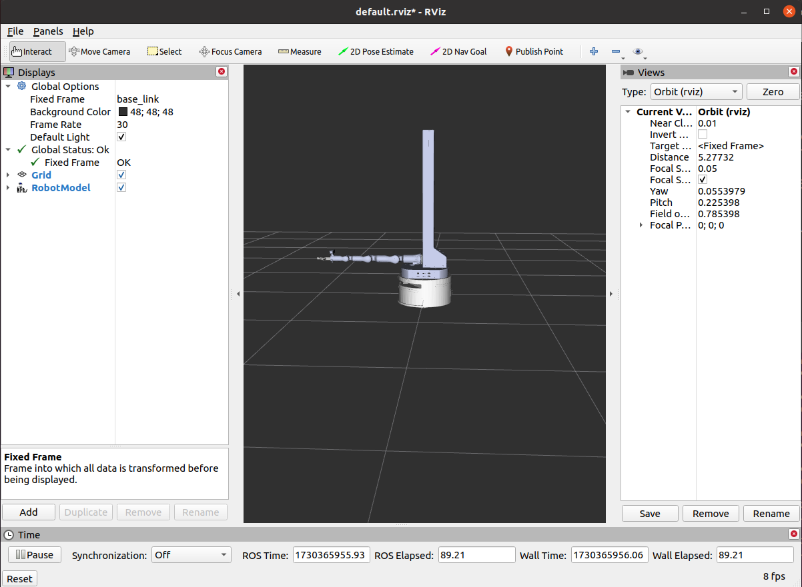
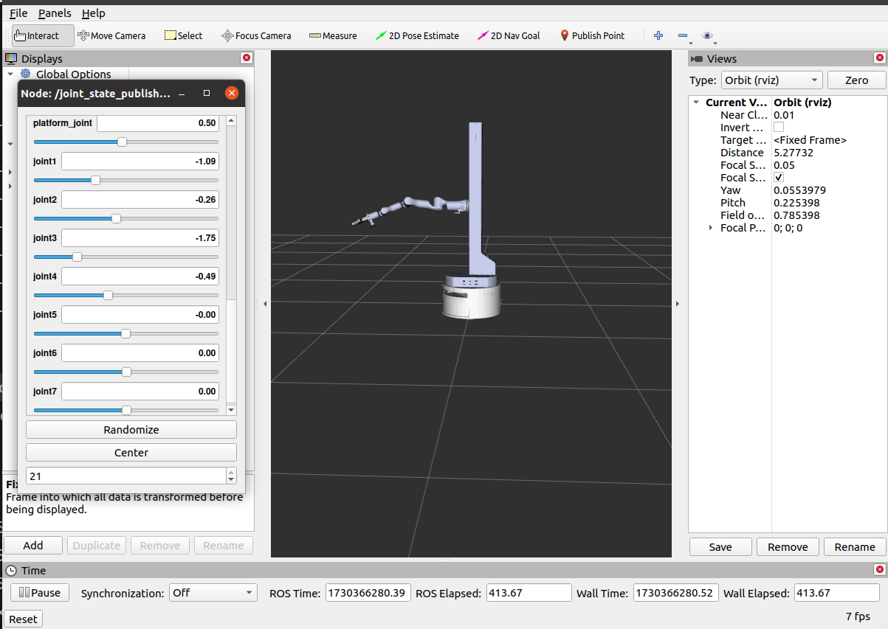
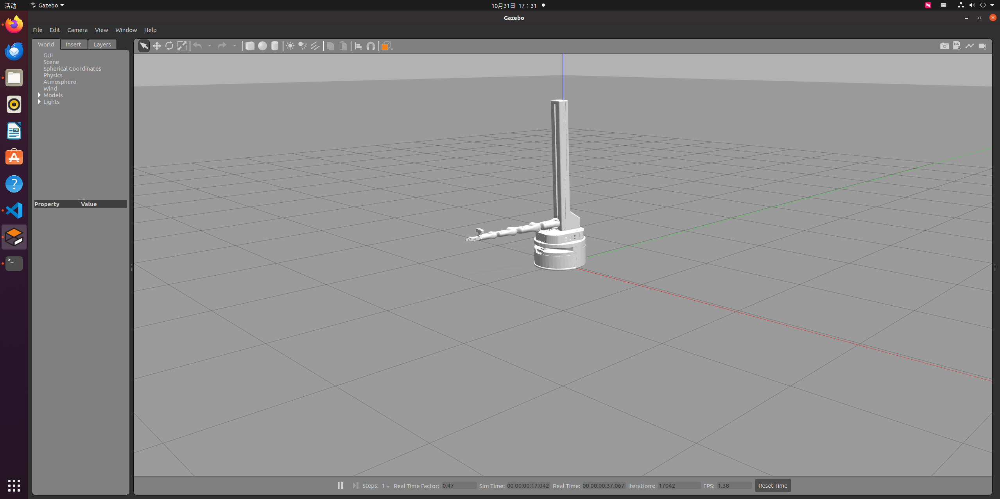

# URDF转XACRO拼接模型

## 一、 项目概述

### 1.1 项目背景与目标

#### 1.1.1 项目背景

1. **发展需求**：

   - 随着机器人技术的快速发展，尤其是工业机器人和移动机器人的应用越来越广泛，需要高效、灵活且可扩展的方法来设计和开发机器人模型。

   - 在机器人开发过程中，URDF（Unified Robot Description Format）是ROS（Robot Operating System）中用于描述机器人模型的标准格式，但其可复用性和可维护性有限。

2. **Xacro的优势**：

   - Xacro（XML Macros）是ROS中用于生成URDF的一种工具，通过宏定义和属性封装，可以显著简化URDF文件的复杂性，提高代码的可复用性和可维护性。
   - 通过Xacro，可以将复杂的机器人模型拆分为多个模块化的文件，便于管理和维护，同时支持参数化配置，方便不同型号机器人的快速开发。

3. **应用场景**：

   - 本案例中提到的睿尔曼复合升降机器人是一种集成了底盘、机械臂、升降平台和夹爪的多功能机器人，适用于物流、仓储、自动化生产等场景。
   - 这种机器人需要在ROS框架下进行仿真和控制，因此需要一个高效且灵活的URDF模型来支持其开发和测试。

#### 1.1.2 项目目标

- **模块化**：通过模块化设计，实现不同部件的独立开发和测试，同时支持快速组装和配置。
- **参数化**：利用Xacro的宏定义功能，将重复的代码段封装为可复用的模板，减少冗余代码，提高开发效率。
- **易推广**：通过文档和示例代码，降低开发门槛，促进机器人技术的推广和应用。

#### 1.1.3 总结

该项目旨在通过Xacro技术实现睿尔曼复合升降机器人的URDF模型的高效开发和管理，同时支持ROS框架下的仿真和控制。其核心目标是提高机器人开发的效率、灵活性和可维护性，为工业和物流场景中的机器人应用提供技术支持。

### 1.2 核心功能

#### 1.2.1 模块化设计

1. 将机器人拆分为底盘、机械臂、升降平台和夹爪等独立模块，每个模块都有独立的Xacro文件，便于管理和维护。

2. 支持独立开发和测试，便于后续的组装和配置。

#### 1.2.2 参数化配置

1. 利用Xacro的宏定义功能，实现机器人模型的参数化设计。

2. 支持不同型号机器人（如RM65-B和RM75-B）的快速开发和调整，减少重复代码。

#### 1.2.3 仿真与控制支持

1. 配置Gazebo仿真环境，确保机器人模型能够在仿真环境中正常运行。

2. 支持控制插件集成，提供完整的仿真和控制流程，包括RVIZ可视化和Gazebo仿真测试，验证机器人模型的正确性和功能完整性。

#### 1.2.4 高效开发与维护

1. 提高代码的可复用性和可维护性，降低开发门槛。

2. 提供详细的教程和文档，帮助开发者快速掌握Xacro的使用方法和机器人模型的开发流程。

### 1.3 更新日志

|  更新日期  |                  更新内容                  | 版本号 |
| :--------: | :----------------------------------------: | :----: |
| 2025/02/17 | 复合升降机器人URDF模型拼接项目初始版本发布 | v1.0.0 |

## 二、 软件环境

- **系统版本**
  - **Ubuntu版本：** 20.04
  - **系统架构：** X86/ARM64
- **软件版本**
  - **ROS：** neotic

## 三、 准备阶段

### 3.1 功能包获取

请参考[附录-相关资源获取](#附录-相关资源获取)获取对应功能包，参照如下描述进行集成拓展。本文以RM75-B为例进行集成拓展，其他类型机械臂亦可参考此案例进行拼接拓展。<br>
目前仅提供了RM65-B和RM75-B两种类型机械臂的对应功能包，其他类型机械臂请联系技术支持进行获取。

### 3.2 功能包结构

本文档主要基于 ROS1 框架，以睿尔曼复合升降机器人为示例进行讲解，最终形成的项目空间目录结构如下：

```shell
rm_Lifting_robot_75B_jaw_description                                # 75B机器人描述功能包
├── CMakeLists.txt
├── config
│   └── joint_names_75_body_single_arm_Lifting_description.yaml
├── export.log
├── launch
│   ├── display.launch                                              # 启动rviz展示机器人模型
│   └── gazebo.launch                                               # 启动gazebo仿真
├── meshes                                                          # 模型文件
│   ├── 4C2_baselink.STL
│   ├── 4C2_Link1.STL
│   ├── 4C2_Link2.STL
│   ├── 4C2_Link3.STL
│   ├── 4C2_Link4.STL
│   ├── 4C2_Link5.STL
│   ├── 4C2_Link6.STL
│   ├── arm_base_link1.STL
│   ├── arm_base_link.STL
│   ├── base_link.STL
│   ├── body_base_link1.STL
│   ├── body_base_link.STL
│   ├── l_wheel_link.STL
│   ├── medium_wheel_link2.STL
│   ├── min_wheel_link1.STL
│   ├── platform_link.STL
│   ├── r_link1.STL
│   ├── r_link2.STL
│   ├── r_link3.STL
│   ├── r_link4.STL
│   ├── r_link5.STL
│   ├── r_link6.STL
│   ├── r_link7.STL
│   ├── r_wheel_link.STL
│   ├── swivel_wheel_link1_1.STL
│   ├── swivel_wheel_link1_2.STL
│   ├── swivel_wheel_link2_1.STL
│   ├── swivel_wheel_link2_2.STL
│   ├── swivel_wheel_link3_1.STL
│   ├── swivel_wheel_link3_2.STL
│   ├── swivel_wheel_link4_1.STL
│   └── swivel_wheel_link4_2.STL
├── package.xml
└── urdf
    ├── agv.urdf.xacro                                           # 底盘URDF
    ├── common_gazebo.xacro                                      # Gazebo仿真控制插件
    ├── jaw_transmission.xacro                                   # 夹爪传动配置
    ├── jaw.urdf.xacro                                           # 夹爪URDF
    ├── joint.urdf.xacro                                         # 不同模块之间的关节URDF描述
    ├── platform.urdf.xacro                                      # 升降平台URDF描述
    ├── rm75_transmission.xacro                                  # rm75机械臂传动配置
    ├── rm75.urdf.xacro                                          # rm75机械臂URDF描述
    ├── rm_Lifting_robot_75B_jaw_description.csv
    ├── rm_Lifting_robot_75B_jaw_description.urdf
    └── rm_Lifting_robot_75B_jaw_description.urdf.xacro          # 将各模块的Xacro文件整合成完整的URDF文件
```

**以RM75-B机器人描述功能包为例**：

- 在 urdf 文件夹中，我们将机器人模型拆分为底盘、机械臂、升降平台和夹爪四个独立的 Xacro （`agv.urdf.xacro`、`jaw.urdf.xacro`、`platform.urdf.xacro`、`rm75.urdf.xacro` ）文件，以便于管理和配置。
- 在主 Xacro 文件（`rm_Lifting_robot_75B_jaw_description.urdf.xacro`）中将底盘、机械臂、升降平台和夹爪四个模块整合为完整的模型。
- 在 `common_gazebo.xacro` 文件中配置仿真插件，用于 Gazebo 仿真，如控制机器人移动的插件 `libgazebo_ros_control.so`，确保机器人在 Gazebo 中能够接收控制命令并完成相应的动作。
- 在每个模块均引入 `transmission` 配置，定义机器人关节与控制器之间的传动关系。确保Gazebo中的控制器插件能够正确计算关节的输入/输出，提供更精确的运动控制，模拟实际机器人驱动结构。

## 四、 代码接口说明

### 4.1 Xacro文件语法解释

以agv.urdf.xacro为例，一个完整的Xacro文件的语法构成如下:

```xml
<?xml version="1.0" encoding="utf-8"?>
<robot name="agv" xmlns:xacro="http://www.ros.org/wiki/xacro">
  <!-- Define constants -->
  <xacro:property name="mesh_path"                                 value="package://rm_Lifting_robot_75B_jaw_description/meshes/" />           <!-- 定义属性 -->
  <!-- Macro to define a generic link with mass, inertia, and visual -->
  <xacro:macro name="visual_collision" params="mesh">                       <!-- 定义宏 -->
      <visual>
         <origin xyz="0 0 0" rpy="0 0 0" />
         <geometry>
              <mesh filename="${mesh_path}${mesh}" />
         </geometry>
         <material name="">
             <color rgba="1 1 1 1" />
         </material>
      </visual>
      <collision>
         <origin xyz="0 0 0" rpy="0 0 0" />
         <geometry>
             <mesh filename="${mesh_path}${mesh}" />
         </geometry>
       </collision>
  </xacro:macro> 
  <link name="base_link">
     <inertial>
         <origin xyz="-0.00022588 -0.029317 0.067118" rpy="0 0 0" />
         <mass value="3.652" />
         <inertia ixx="0.040658" ixy="-4.1019E-05" ixz="0.00010805"
          iyy="0.085621" iyz="-0.00031013" izz="0.10712" />
     </inertial>
     <xacro:visual_collision mesh="base_link.STL" />                          <!-- 调用宏 -->
  </link>
  ...
  <joint name="r_wheel_joint_1" type="continuous">
    <origin xyz="-0.151 0 -0.0109" rpy="0 0 0" />
    <parent link="base_link" />
    <child link="r_wheel_link" />
    <axis xyz="1 0 0" />
    <limit effort="100" velocity="10" />
  </joint>
  ...
</robot>
```

#### 4.1.1 头文件

```xml
<?xml version="1.0" encoding="utf-8"?>
<robot name="agv" xmlns:xacro="http://www.ros.org/wiki/xacro">
```

**函数定义**：

- `<?xml version="1.0"?>`:声明XML文件的版本和编码方式。

- `<robot>`：ROS 定义的机器人描述文件的根元素，`name` 属性表示机器人的名称，可根据具体情况自定义。

- 在使用xacro生成urdf时，根标签`robot`中必须包含`xmlns:xacro="http://www.ros.org/wiki/xacro`。

#### 4.1.2 属性定义

``` xml
<!-- Define constants -->
<xacro:property name="mesh_path"           value="package://rm_Lifting_robot_75B_jaw_description/meshes/" />
```

**函数定义**：

- 使用`<xacro:property>`标签定义属性，`name`指定属性的名称，`value`指定所定义的属性的值。

- 用于封装URDF中的一些参数，比如PI值、尺寸、颜色、模型路径等，方便调试和修改参数。

- 属性调用：{属性名称}，比如{mesh_path}。

#### 4.1.3 宏定义

在 URDF 文件中，通过封装重复率较高的代码段到宏（macro）中，可以显著提高代码复用率，并优化代码的整体结构。

``` xml
 <!-- Macro to define a generic link with mass, inertia, and visual -->
  # 定义宏名称和参数（多参数之间使用空格分隔）
  <xacro:macro name="visual_collision" params="mesh"> 
      <visual>
         <origin xyz="0 0 0" rpy="0 0 0" />
         <geometry>
            <mesh filename="${mesh_path}${mesh}" />   
         </geometry>
         <material name="">
            <color rgba="1 1 1 1" />
         </material>
      </visual>
      <collision>
         <origin xyz="0 0 0" rpy="0 0 0" />
         <geometry>
             <mesh filename="${mesh_path}${mesh}" />
         </geometry>
       </collision>
  </xacro:macro> 
```

**函数定义**：

- 使用 `<xacro:macro>` 标签定义宏，属性 `name` 指定宏名称，`params` 定义宏的参数，当存在多个参数时，参数之间用空格分隔，即`<xacro:macro name="visual_collision" params="mesh color">`。

- 参数调用格式：{参数名}，以上述代码为例，参数调用为{mesh}。

- 宏调用：`<xacro:宏名称 参数1="xxx" 参数2="xxx" />`，例如，要调用`visual_collision` 宏并传入 `mesh` 参数，可以这样写 `<xacro:visual_collision mesh="base_link.STL" />`。

#### 4.1.4 文件包含

机器人由多模块组成，不同部件可能封装为单独的xacro文件，最后再将不同的文件集成，组合为完整的机器人，可以使用文件包含实现，具体实现代码如下：

```xml
<?xml version="1.0"?>
<robot name="rm_Lifting_robot_75B_jaw_description" xmlns:xacro="http://www.ros.org/wiki/xacro">
  <!-- 引入其他xacro文件：地盘、夹爪、升降平台、机械臂及关节 -->
  <xacro:include filename="$(find rm_Lifting_robot_75B_jaw_description)/urdf/agv.urdf.xacro"/>
  <xacro:include filename="$(find rm_Lifting_robot_75B_jaw_description)/urdf/jaw.urdf.xacro"/>
  <xacro:include filename="$(find rm_Lifting_robot_75B_jaw_description)/urdf/platform.urdf.xacro"/>
  <xacro:include filename="$(find rm_Lifting_robot_75B_jaw_description)/urdf/rm75.urdf.xacro"/>
  <xacro:include filename="$(find rm_Lifting_robot_75B_jaw_description)/urdf/joint.urdf.xacro"/>
  <!-- 在gazebo仿真环境中添加控制传动配置及Gazebo专用插件 -->
  <xacro:include filename="$(find rm_Lifting_robot_75B_jaw_description)/urdf/common_gazebo.xacro"/>
  <xacro:include filename="$(find rm_Lifting_robot_75B_jaw_description)/urdf/rm75_transmission.xacro"/>
  <xacro:include filename="$(find rm_Lifting_robot_75B_jaw_description)/urdf/jaw_transmission.xacro"/>
</robot>
```

### 4.2 传动配置的Xacro文件

#### 4.2.1 夹爪的传动配置文件

```xml
<?xml version="1.0"?>
<robot xmlns:xacro="http://www.ros.org/wiki/xacro">
  <xacro:macro name="rm75_jaw_transmission" params="joint_name">
    <transmission name="${joint_name}_trans">
      <type>transmission_interface/SimpleTransmission</type>
      <joint name="${joint_name}">
        <hardwareInterface>PositionJointInterface</hardwareInterface>
      </joint>
      <actuator name="${joint_name}_motor">
        <mechanicalReduction>1</mechanicalReduction>
      </actuator>
    </transmission>
  </xacro:macro>

  <xacro:rm75_jaw_transmission joint_name="jaw_Joint1" />
  <xacro:rm75_jaw_transmission joint_name="jaw_Joint2" />
  <xacro:rm75_jaw_transmission joint_name="jaw_Joint3" />
  <xacro:rm75_jaw_transmission joint_name="jaw_Joint4" />
  <xacro:rm75_jaw_transmission joint_name="jaw_Joint5" />
  <xacro:rm75_jaw_transmission joint_name="jaw_Joint6" />
</robot>
```

#### 4.2.2 机械臂的传动配置文件

```xml
<?xml version="1.0"?>
<robot xmlns:xacro="http://www.ros.org/wiki/xacro">
  <xacro:macro name="rm75_transmission" params="joint_name">
    <transmission name="${joint_name}_trans">
      <type>transmission_interface/SimpleTransmission</type>
      <joint name="${joint_name}">
        <hardwareInterface>PositionJointInterface</hardwareInterface>
      </joint>
      <actuator name="${joint_name}_motor">
        <mechanicalReduction>1</mechanicalReduction>
      </actuator>
    </transmission>
  </xacro:macro>
  <xacro:rm75_transmission joint_name="joint1" />
  <xacro:rm75_transmission joint_name="joint2" />
  <xacro:rm75_transmission joint_name="joint3" />
  <xacro:rm75_transmission joint_name="joint4" />
  <xacro:rm75_transmission joint_name="joint5" />
  <xacro:rm75_transmission joint_name="joint6" />
  <xacro:rm75_transmission joint_name="joint7" />
  <xacro:rm75_transmission joint_name="platform_joint" />
</robot>
```

### 4.3 Gazebo仿真控制插件xacro文件

```xml
<?xml version="1.0" ?>
<robot xmlns:xacro="http://www.ros.org/wiki/xacro">
  <gazebo>
    <plugin name="control" filename="libgazebo_ros_control.so">
      <robotNamespace>/</robotNamespace>
      <robotSimType>gazebo_ros_control/DefaultRobotHWSim</robotSimType>
      <legacyModeNS>true</legacyModeNS>
    </plugin>
  </gazebo>
</robot>
```

### 4.4 将URDF文件拆解成Xacro文件

以创建`rm75.urdf.xacro`文件为例，以下是将URDF文件转换为Xacro文件的详细步骤。

#### 4.4.1 复制URDF内容

将`rm_Lifting_robot_75B_jaw_description.urdf`机械臂相关的部分复制到一个新的文件中，命名为`rm75.urdf.xacro`。

```xml
<!-- RM75-B机械臂 --> 
  <link
    name="r_link1">
    <inertial>
      <origin
        xyz="2.8966E-07 0.025188 -0.021107"
        rpy="0 0 0" />
      <mass
        value="0.59353" />
      <inertia
        ixx="0.0012661"
        ixy="-2.0397E-09"
        ixz="-5.3423E-09"
        iyy="0.00056131"
        iyz="-0.00021118"
        izz="0.0011816" />
    </inertial>
    <visual>
      <origin
        xyz="0 0 0"
        rpy="0 0 0" />
      <geometry>
        <mesh
          filename="package://rm_Lifting_robot_75B_jaw_description/meshes/r_link1.STL" />
      </geometry>
      <material
        name="">
        <color
          rgba="0.79216 0.81961 0.93333 1" />
      </material>
    </visual>
    <collision>
      <origin
        xyz="0 0 0"
        rpy="0 0 0" />
      <geometry>
        <mesh
          filename="package://rm_Lifting_robot_75B_jaw_description/meshes/r_link1.STL" />
      </geometry>
    </collision>
  </link>
  <joint
    name="joint1"
    type="revolute">
    <origin
      xyz="0 0 0.2405"
      rpy="-1.5708 0 3.1416" />
    <parent
      link="arm_base_link1" />
    <child
      link="r_link1" />
    <axis
      xyz="0 -1 0" />
    <limit
      lower="-3.11"
      upper="3.11"
      effort="60"
      velocity="3.14" />
  </joint>
  <link
    name="r_link2">
    <inertial>
      <origin
        xyz="3.7069E-07 0.011077 0.07613"
        rpy="0 0 0" />
      <mass
        value="0.43285" />
      <inertia
        ixx="0.0012584"
        ixy="7.782E-10"
        ixz="3.39E-09"
        iyy="0.0012224"
        iyz="0.00027899"
        izz="0.00031747" />
    </inertial>
    <visual>
      <origin
        xyz="0 0 0"
        rpy="0 0 0" />
      <geometry>
        <mesh
          filename="package://rm_Lifting_robot_75B_jaw_description/meshes/r_link2.STL" />
      </geometry>
      <material
        name="">
        <color
          rgba="0.79216 0.81961 0.93333 1" />
      </material>
    </visual>
    <collision>
      <origin
        xyz="0 0 0"
        rpy="0 0 0" />
      <geometry>
        <mesh
          filename="package://rm_Lifting_robot_75B_jaw_description/meshes/r_link2.STL" />
      </geometry>
    </collision>
  </link>
  <joint
    name="joint2"
    type="revolute">
    <origin
      xyz="0 0 0"
      rpy="1.5708 0 0" />
    <parent
      link="r_link1" />
    <child
      link="r_link2" />
    <axis
      xyz="0 1 0" />
    <limit
      lower="-2.27"
      upper="2.27"
      effort="60"
      velocity="3.14" />
  </joint>
  ...
  <link
    name="r_link7">
    <inertial>
      <origin
        xyz="-0.028764 5.1464E-06 0.023085"
        rpy="0 0 0" />
      <mass
        value="0.22147" />
      <inertia
        ixx="0.0001376"
        ixy="-5.7488E-08"
        ixz="1.6634E-05"
        iyy="0.00026855"
        iyz="-1.7799E-08"
        izz="0.00035277" />
    </inertial>
    <visual>
      <origin
        xyz="0 0 0"
        rpy="0 0 0" />
      <geometry>
        <mesh
          filename="package://rm_Lifting_robot_75B_jaw_description/meshes/r_link7.STL" />
      </geometry>
      <material
        name="">
        <color
          rgba="0.79216 0.81961 0.93333 1" />
      </material>
    </visual>
    <collision>
      <origin
        xyz="0 0 0"
        rpy="0 0 0" />
      <geometry>
        <mesh
          filename="package://rm_Lifting_robot_75B_jaw_description/meshes/r_link7.STL" />
      </geometry>
    </collision>
  </link>
  <joint
    name="joint7"
    type="revolute">
    <origin
      xyz="0 -0.00028182 0.117"
      rpy="-0.00015298 0 0" />
    <parent
      link="r_link6" />
    <child
      link="r_link7" />
    <axis
      xyz="0 0 1" />
    <limit
      lower="-6.28"
      upper="6.28"
      effort="10"
      velocity="3.925" />
  </joint>
```

#### 4.4.2 拆解过程分析

1. 在新创建的`rm75.urdf.xacro`文件的顶部，添加Xacro特有的头文件。

   ```xml
   <?xml version="1.0"?>
   <robot name="rm75" xmlns:xacro="http://www.ros.org/wiki/xacro">  <!--定义机器人名称为rm75-->
   ```

2. 定义属性（通常考虑尺寸、颜色、模型路径、PI值等）。

   ```xml
   <!-- Define constants -->
   <xacro:property name="mesh_path" value="package://rm_Lifting_robot_75B_jaw_description/meshes/" />
   ```

3. 仔细观察URDF模型代码，找出其中重复率高的代码段。

   ```xml
   <visual>
     <origin
       xyz="0 0 0"
       rpy="0 0 0" />
     <geometry>
       <mesh
         filename="package://rm_Lifting_robot_75B_jaw_description/meshes/r_link4.STL" />
     </geometry>
     <material
       name="">
       <color
         rgba="0.79216 0.81961 0.93333 1" />
     </material>
   </visual>
   <collision>
     <origin
       xyz="0 0 0"
       rpy="0 0 0" />
     <geometry>
       <mesh
         filename="package://rm_Lifting_robot_75B_jaw_description/meshes/r_link4.STL" />
     </geometry>
   </collision>
   ```

4. 将识别出的重复代码段转换为Xacro宏。Xacro宏允许你定义可重用的模板，这些模板可以在文件中多次调用，以减少重复代码并提高可维护性。

   ```xml
   <!-- Macro to define a generic link with mass, inertia, and visual -->
   <xacro:macro name="visual_collision" params="mesh">           # 定义宏名称和参数
     <visual>
       <origin xyz="0 0 0" rpy="0 0 0" />
       <geometry>
         <mesh filename="${mesh_path}${mesh}" />
       </geometry>
       <material name="">
         <color rgba="0.79216 0.81961 0.93333 1" />
       </material>
     </visual>
     <collision>
       <origin xyz="0 0 0" rpy="0 0 0" />
       <geometry>
         <mesh filename="${mesh_path}${mesh}" />
       </geometry>
     </collision>
   </xacro:macro>
   ```

5. 在`rm75.urdf.xacro`文件中，用定义好的Xacro宏替换原有的重复代码段。确保替换后的结构保持不变，只改变重复部分的实现方式。

   ```xml
   <link name="arm_base_link1">
     <inertial>
       <origin xyz="0.00033281 2.206E-05 0.060153" rpy="0 0 0" />
       <mass value="0.83984" />
       <inertia ixx="0.0017115" ixy="4.0276E-06" ixz="4.7032E-05" 
       iyy="0.0016829" iyz="-1.8665E-06" izz="0.00089154" />
     </inertial>
     <xacro:visual_collision mesh="arm_base_link1.STL" />                 #宏调用
   </link>
   <link name="r_link1">
     <inertial>
       <origin xyz="2.8966E-07 0.025188 -0.021107" rpy="0 0 0" />
       <mass value="0.59353" />
       <inertia ixx="0.0012661" ixy="-2.0397E-09" ixz="-5.3423E-09"
         iyy="0.00056131" iyz="-0.00021118" izz="0.0011816" />           
     </inertial>
     <xacro:visual_collision mesh="r_link1.STL" />                         #宏调用
   </link>
   ...  
   <joint name="joint1" type="revolute">                                  #joint部分保持不变
     <origin xyz="0 0 0.2405" rpy="-1.5708 0 3.1416" />
     <parent link="arm_base_link1" />
     <child link="r_link1" />
     <axis xyz="0 -1 0" />
     <limit lower="-3.11" upper="3.11" effort="60" velocity="3.14" />
   </joint>
   <joint name="joint2" type="revolute">
     <origin xyz="0 0 0" rpy="1.5708 0 0" />
     <parent link="r_link1" />
     <child link="r_link2" />
     <axis xyz="0 1 0" />
     <limit lower="-2.27" upper="2.27" effort="60" velocity="3.14" />
   </joint>
   ...
   ```

## 五、 案例验证

**方法一：**

使用`xacro`命令行工具来验证新创建的Xacro文件是否正确无误。例如，可以通过以下命令将Xacro文件转换回URDF格式进行验证。

```sh
cd <你的工作空间名称>/src/rm_description/rm_Lifting_robot_75B_jaw_description/urdf    # 进入到urdf文件夹

xacro --inorder rm75.urdf.xacro    # xacro --inorder <xacro文件名>
```

检查生成的URDF文件是否与原始URDF文件在功能和结构上保持一致。

**方法二：**

```sh
# 构建工作空间
mkdir -p <你的工作空间名称>/src
# 进入工作空间目录
cd <你的工作空间名称>
# 编译
catkin build
# 添加工作空间环境变量
source ./devel/setup.bash
# 启动配置好的功能包
roslaunch rm_Lifting_robot_75B_jaw_description display.launch
```

进入RVIZ页面后，首先将Fixed Frame设置为base_link，点击Add，找到RobotModel，最后点击OK。



模型显示结果如下图所示。



可以使用 `joint_state_publisher_gui` 在 `RViz` 中测试机械臂的各关节状态，一切功能正常。



```sh
# 构建工作空间
mkdir -p <你的工作空间名称>/src
# 进入工作空间目录
cd <你的工作空间名称>
# 编译
catkin build
# 添加工作空间环境变量
source ./devel/setup.bash
# 测试模型是否可以在gazebo中显示
roslaunch rm_Lifting_robot_75B_jaw_description gazebo.launch  
```

`gazebo.launch`文件的作用是读取参数服务器里面`robot_description`内容通过`urdf_spawner`节点生成机器人模型，内容如下。

```xml
<launch>
   <arg name="paused" default="false" /> 
   <arg name="use_sim_time" default="true" />
   <arg name="gui" default="true" />
   <arg name="headless" default="false" /> 
   <arg name="debug" default="false" /> 
   <include file="$(find gazebo_ros)/launch/empty_world.launch">
      <arg name="debug" value="$(arg debug)" />
      <arg name="gui" value="$(arg gui)" />
      <arg name="paused" value="$(arg paused)" />
      <arg name="use_sim_time" value="$(arg use_sim_time)" /> 
   </include>
   <param name="robot_description" command="$(find xacro)/xacro '$(find rm_Lifting_robot_75B_jaw_description)/urdf/rm_Lifting_robot_75B_jaw_description.urdf.xacro'" />
  <!--<param name="robot_description" textfile="$(find rm_Lifting_robot_75B_jaw_description)/urdf/rm_Lifting_robot_75B_jaw_description.urdf" />-->
   <node name="urdf_spawner" pkg="gazebo_ros" type="spawn_model" respawn="false" output="screen" args="-urdf -model rm_Lifting_robot_75B_jaw_description -param robot_description -x 0 -y 0 -z 0.1" />
</launch>
```



至此，机器人模型成功加载至`gazebo`中。

## 六、 视频演示

[演示视频](https://ik.imagekit.io/Realman/Video/video.mp4?updatedAt=1740362020561)

## 附录： 相关资源获取

[RM75臂模型配置功能包压缩文件](./rm_Lifting_robot_75B_jaw_description.zip)

[RM65臂模型配置功能包压缩文件](./rm_Lifting_robot_65B_jaw_description.zip)
